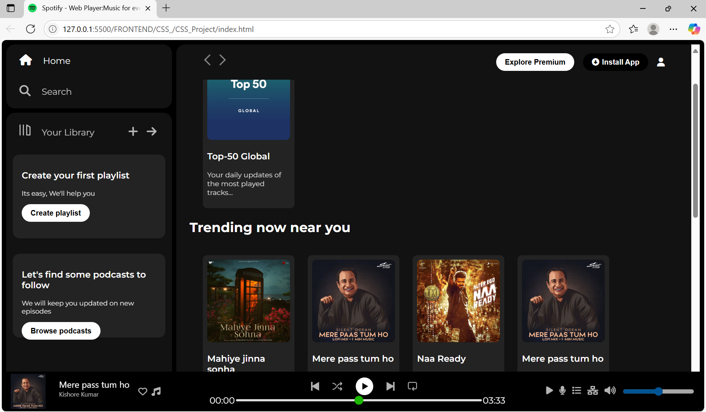

# 🎵 Spotify Clone (HTML & CSS Only)

This is a **responsive front-end clone of Spotify** built using only **HTML and CSS**. It mimics the layout and design of Spotify’s web player, including side navigation, music player controls, and content sections like "Recently Played", "Trending", and "Featured Charts".

### 🌐 Live Demo
👉 [View Live Website](https://priyanka-manapuram.github.io/spotify-clone-html-css/)

---

## 📁 Features

- 🎨 Pure HTML and CSS only (no JavaScript)
- 🧭 Sidebar navigation (Home, Search, Library)
- 📦 Album and playlist cards
- 🎶 Music player layout with control icons
- 📱 Fully responsive layout for various screen sizes
- 💡 Font Awesome icons integration

---

## 📸 Screenshots

### 💻 Desktop View

---

## 🛠️ Tech Stack

- HTML5
- CSS3
- Font Awesome (for icons)
- Google Fonts (Montserrat)
